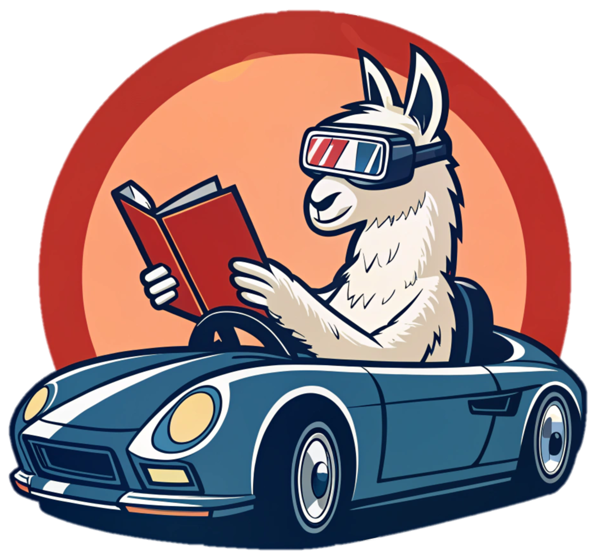
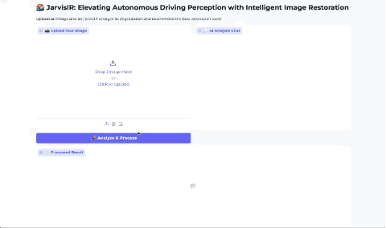
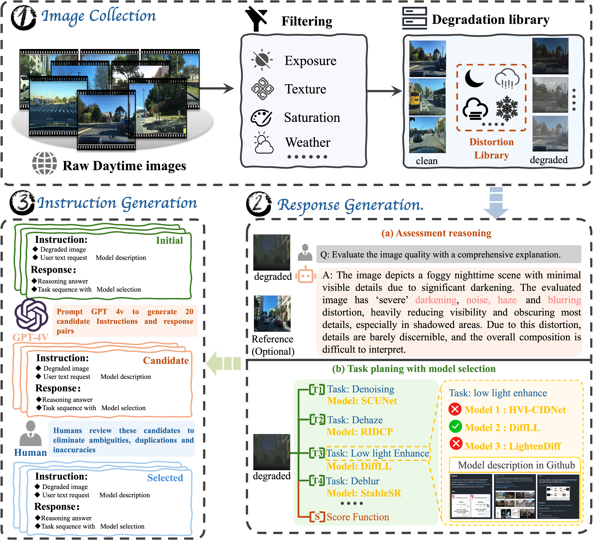

<div align="center">
  <h1>[CVPR' 2025] JarvisIR: Elevating Autonomous Driving Perception with Intelligent Image Restoration</h1>
</div>

<div align="center">
  
</div>

<div align="center">
  <a href="https://lyl1015.github.io/papers/CVPR2025_JarvisIR.pdf" target="_blank" rel="noopener noreferrer">
    
  </a>
  <!-- <a href="#"></a> -->
  <a href="https://cvpr2025-jarvisir.github.io/"></a>
  <a href="#"></a>
  <a href="https://github.com/LYL1015/JarvisIR?tab=readme-ov-file/"></a>
  <a href="https://github.com/LYL1015/JarvisIR/blob/main/docs/gradio_demo.md"></a>
</div>

<div align="center">
  <p>
    <a href="https://lyl1015.github.io/">Yunlong Lin</a><sup>1*♣</sup>, 
    <a href="https://github.com/LYL1015/JarvisIR">Zixu Lin</a><sup>1*♣</sup>, 
    <a href="https://haoyuchen.com/">Haoyu Chen</a><sup>2*</sup>, 
    <a href="https://paulpanwang.github.io/">Panwang Pan</a><sup>3*</sup>, 
    <a href="https://chenxinli001.github.io/">Chenxin Li</a><sup>6</sup>, 
    <a href="https://ephemeral182.github.io/">Sixiang Chen</a><sup>2</sup>, 
    <a href="https://kairunwen.github.io/">Kairun Wen</a><sup>1</sup>, 
    <a href="https://jinyeying.github.io/">Yeying Jin</a><sup>4</sup>, 
    <a href="https://fenglinglwb.github.io/">Wenbo Li</a><sup>5†</sup>, 
    <a href="https://scholar.google.com/citations?user=k5hVBfMAAAAJ&hl=zh-CN">Xinghao Ding</a><sup>1†</sup>
  </p>
</div>

<div align="center">
  <p>
    <sup>1</sup>Xiamen University, <sup>2</sup>The Hong Kong University of Science and Technology (Guangzhou), <sup>3</sup>Bytedance's Pico, <sup>4</sup>Tencent, <sup>5</sup>Huawei Noah's Ark Lab, <sup>6</sup>The Chinese University of Hong Kong
  </p>
  <!-- <sup>*</sup>Equal Contribution <sup>♣</sup>Equal Contribution <sup>†</sup>Corresponding Author -->
  <p>Accepted by CVPR 2025</p>
</div>

<!-- <div align="center">
  <video width="800" controls>
    <source src="assets/demo.mp4" type="video/mp4">
    Your browser does not support the video tag.
  </video>
  <p>JarvisIR Demo Video: Showcasing image restoration capabilities under various adverse weather conditions</p>
</div> -->
<!-- https://github.com/user-attachments/assets/d9094fba-e24c-403e-90cb-b3d2f6e48939 -->
<div align="center">
  
  <p></p>
</div>

<div align="center">
  
  <p>JarvisIR Gradio Demo: Showcasing image restoration capabilities under various adverse weather conditions</p>
</div>


## :postbox: Updates
<!-- - 2023.12.04: Add an option to speed up the inference process by adjusting the number of denoising steps. -->
<!-- - 2024.2.9: Release our demo codes and models. Have fun! :yum: -->
- 2025.6.9: Released Gradio demo, restoration tools and SFT training code.
- 2025.4.8: This repo is created.

## 🧭 Navigation

<!-- ### 🚀 Quick Start -->
- [Overview](#diamonds-overview) 
- [Getting Started](#computer-getting-started) 
- [Gradio Demo](./docs/gradio_demo.md) 
- [SFT Training](./docs/sft_training.md)
- [Restoration Tools](#toolbox-expert-models)
- [Acknowledgements](#pray-acknowledgements)
- [License](#page_with_curl-license)


---


## :diamonds: Overview
JarvisIR (CVPR 2025) is a VLM-powered agent designed to tackle the challenges of vision-centric perception systems under unpredictable and coupled weather degradations. It leverages the VLM as a controller to manage multiple expert restoration models, enabling robust and autonomous operation in real-world conditions. JarvisIR employs a novel two-stage framework consisting of supervised fine-tuning and human feedback alignment, allowing it to effectively fine-tune on large-scale real-world data in an unsupervised manner. Supported by CleanBench, a comprehensive dataset with 150K synthetic and 80K real instruction-response pairs, JarvisIR demonstrates superior decision-making and restoration capabilities, achieving a 50% improvement in the average of all perception metrics on CleanBench-Real.
<div align="center">
  
</div>

<!-- ## :rocket: Method

JarvisIR implements an innovative two-stage framework that leverages a Vision-Language Model (VLM) as a controller to manage multiple expert restoration models:

1. **Supervised Fine-tuning Stage**: JarvisIR undergoes supervised fine-tuning on synthetic data from CleanBench to enable it to follow user instructions and recognize image degradation. This initial training allows the model to identify various types of image degradation and select appropriate restoration strategies.

2. **Human Feedback Alignment Stage**: We further finetune JarvisIR on CleanBench-Real using the MRRHF algorithm to improve system robustness, reduce hallucinations, and enhance generalizability under real-world adverse weather conditions. This stage ensures the model makes decisions that align with human expectations in complex real-world scenarios.

The core advantage of JarvisIR lies in its ability to handle multiple complex, coupled weather degradations and provide stable, reliable image inputs for autonomous driving perception systems.

<div align="center">
  
  <p>Two-stage training framework of JarvisIR: The VLM controller analyzes input images, selects and coordinates expert models for optimal restoration</p>
</div>

## :bar_chart: CleanBench Dataset

To support the training and evaluation of JarvisIR, we introduce CleanBench, the first high-quality instruction-following dataset specifically curated for developing intelligent restoration systems. CleanBench contains **150K** synthetic and **80K** real instruction-response pairs, providing a comprehensive foundation for training and evaluating intelligent image restoration systems.

### Dataset Construction

The CleanBench dataset construction workflow consists of three main steps:

1. **Synthesis of Degraded Images**: We generate a diverse set of degraded images by applying various weather conditions and degradation types to clean images, creating realistic scenarios that autonomous driving systems might encounter.

2. **Generation of Assessment Reasoning and Optimal Task Sequence**: For each degraded image, we generate detailed assessments of the degradation types present and determine the optimal sequence of restoration tasks needed to effectively restore the image.

3. **Generation of Instruction-Response Pairs**: Based on the degradation assessment and restoration sequence, we create comprehensive instruction-response pairs that guide the model in understanding user requests and providing appropriate restoration solutions.

<div align="center">
  
  <p>CleanBench dataset construction workflow: from degraded image synthesis to instruction-response pair generation</p>
</div>

### Dataset Features

- **Comprehensive Coverage**: Includes various weather conditions (rain, snow, fog, night) and their combinations
- **High-Quality Annotations**: Detailed degradation assessments and optimal restoration sequences
- **Real-World Examples**: 80K real-world examples to ensure model generalization
- **Instruction Diversity**: Multiple instruction formats to enhance model adaptability

CleanBench serves as a crucial resource for training and evaluating intelligent image restoration systems, enabling models like JarvisIR to make informed decisions about restoration strategies in complex real-world scenarios. -->

## :computer: Getting Started

For sft training and environment setup preparation, please follow:

- [SFT Training](./docs/sft_training.md)
<!-- - [Dataset Preparation](./docs/dataset_preparation.md) -->
<!-- 
For sft training, please follow:

- [SFT Training](./docs/sft_training.md) -->

For gradio demo runing, please follow:

- [Gradio Demo](./docs/gradio_demo.md)


## :toolbox: Expert Models

JarvisIR integrates multiple expert restoration models to handle various types of image degradation. To test the performance of individual expert models, please refer to the instructions and scripts provided in `./package/agent_tools/`.

| Task | Model | Description |
|------|-------|-------------|
| **Super-resolution** | Real-ESRGAN | Fast GAN-based model for super-resolution, deblurring, and artifact removal |
| **Denoising** | SCUNet | Hybrid UNet-based model combining convolution and transformer blocks for robust denoising |
| **Deraining** | UDR-S2Former | Uncertainty-aware transformer model for rain streak removal |
|  | Img2img-turbo-rain | Efficient SD-turbo based model for fast and effective rain removal |
| **Raindrop removal** | IDT | Transformer-based model for de-raining and raindrop removal |
| **Dehazing** | RIDCP | Efficient dehazing model utilizing high-quality codebook priors |
|  | KANet | Efficient dehazing network using a localization-and-removal pipeline |
| **Desnowing** | Img2img-turbo-snow | Efficient model for removing snow artifacts while preserving natural scene details |
|  | Snowmaster | Real-world image desnowing via MLLM with multi-model feedback optimization |
| **Low-light enhancement** | Retinexformer | One-stage Retinex-based Transformer for low-light image enhancement |
|  | HVICIDNet | Lightweight transformer for low-light and exposure correction |
|  | LightenDiff | Diffusion-based framework for low-light enhancement |


## :circus_tent: Checklist

- [x] Release preview inference code and gradio demo
- [x] Release SFT training code
- [ ] Release Hugging Face demo
- [ ] Release CleanBench data


## :pray: Acknowledgements

We would like to express our gratitude to [HuggingGPT](https://github.com/microsoft/JARVIS), [XTuner](https://github.com/InternLM/xtuner), and [RRHF](https://github.com/GanjinZero/RRHF) for their valuable open-source contributions which have provided important technical references for our work.


## :love_you_gesture: Citation
```bibtex
@inproceedings{jarvisir2025,
  title={JarvisIR: Elevating Autonomous Driving Perception with Intelligent Image Restoration},
  author={Lin, Yunlong and Lin, Zixu and Chen, Haoyu and Pan, Panwang and Li, Chenxin and Chen, Sixiang and Kairun, Wen and Jin, Yeying and Li, Wenbo and Ding, Xinghao},
  booktitle={Proceedings of the IEEE/CVF Conference on Computer Vision and Pattern Recognition (CVPR)},
  year={2025}
}
```