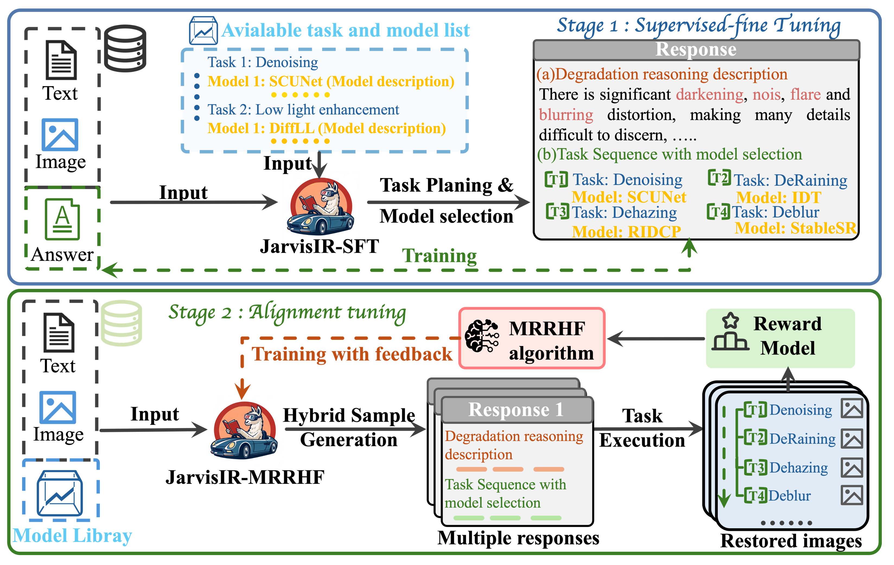

<div align="center">
<div align="center">
  
  <h1>[CVPR' 2025] JarvisIR: Elevating Autonomous Driving Perception with Intelligent Image Restoration</h1>
</div>

<a href="https://lyl1015.github.io/papers/CVPR2025_JarvisIR.pdf" target="_blank" rel="noopener noreferrer">
  
</a>
<!-- <a href="#"></a> -->
<a href="https://cvpr2025-jarvisir.github.io/"></a>
<a href="#"></a>
<a href="https://github.com/LYL1015/JarvisIR?tab=readme-ov-file/"></a>

<!-- **提升自动驾驶感知能力的智能图像恢复技术** -->

<!-- **[厦门大学](https://www.xmu.edu.cn/)** | **[香港科技大学（广州）](https://hkust-gz.edu.cn/)** | **[字节跳动Pico](https://www.picoxr.com/)** | **[腾讯](https://www.tencent.com/)** | **[华为诺亚方舟实验室](https://www.huawei.com/)** | **[香港中文大学](https://www.cuhk.edu.hk/)** -->


[Yunlong Lin](https://lyl1015.github.io/)<sup>1*♣</sup>, [Zixu Lin](https://github.com/)<sup>1*♣</sup>, [Haoyu Chen](https://haoyuchen.com/)<sup>2*</sup>, [Panwang Pan](https://paulpanwang.github.io/)<sup>3*</sup>, [Chenxin Li](https://chenxinli001.github.io/)<sup>6</sup>, [Sixiang Chen](https://ephemeral182.github.io/)<sup>2</sup>, [Kairun Wen](https://kairunwen.github.io/)<sup>1</sup>, [Yeying Jin](https://jinyeying.github.io/)<sup>4</sup>, [Wenbo Li](https://fenglinglwb.github.io/)<sup>5†</sup>, [Xinghao Ding](https://scholar.google.com/citations?user=k5hVBfMAAAAJ&hl=zh-CN)<sup>1†</sup>

<sup>1</sup>Xiamen University, <sup>2</sup>The Hong Kong University of Science and Technology (Guangzhou), <sup>3</sup>Bytedance's Pico, <sup>4</sup>Tencent, <sup>5</sup>Huawei Noah's Ark Lab, <sup>6</sup>The Chinese University of Hong Kong
<!-- <sup>*</sup>Equal Contribution <sup>♣</sup>Equal Contribution <sup>†</sup>Corresponding Author -->
Accepted by CVPR 2025
</div>


## :postbox: Updates
<!-- - 2023.12.04: Add an option to speed up the inference process by adjusting the number of denoising steps. -->
<!-- - 2024.2.9: Release our demo codes and models. Have fun! :yum: -->
- 2025.4.8: This repo is created.

## :diamonds: Overview
JarvisIR (CVPR 2025) is a VLM-powered agent designed to tackle the challenges of vision-centric perception systems under unpredictable and coupled weather degradations. It leverages the VLM as a controller to manage multiple expert restoration models, enabling robust and autonomous operation in real-world conditions. JarvisIR employs a novel two-stage framework consisting of supervised fine-tuning and human feedback alignment, allowing it to effectively fine-tune on large-scale real-world data in an unsupervised manner. Supported by CleanBench, a comprehensive dataset with 150K synthetic and 80K real instruction-response pairs, JarvisIR demonstrates superior decision-making and restoration capabilities, achieving a 50% improvement in the average of all perception metrics on CleanBench-Real.
<div align="center">
  
</div>

## :rocket: Method

JarvisIR implements an innovative two-stage framework that leverages a Vision-Language Model (VLM) as a controller to manage multiple expert restoration models:

1. **Supervised Fine-tuning Stage**: JarvisIR undergoes supervised fine-tuning on synthetic data from CleanBench to enable it to follow user instructions and recognize image degradation. This initial training allows the model to identify various types of image degradation and select appropriate restoration strategies.

2. **Human Feedback Alignment Stage**: We further finetune JarvisIR on CleanBench-Real using the MRRHF algorithm to improve system robustness, reduce hallucinations, and enhance generalizability under real-world adverse weather conditions. This stage ensures the model makes decisions that align with human expectations in complex real-world scenarios.

The core advantage of JarvisIR lies in its ability to handle multiple complex, coupled weather degradations and provide stable, reliable image inputs for autonomous driving perception systems.

<div align="center">
  
  <p>Two-stage training framework of JarvisIR: The VLM controller analyzes input images, selects and coordinates expert models for optimal restoration</p>
</div>

## :bar_chart: CleanBench Dataset

To support the training and evaluation of JarvisIR, we introduce CleanBench, the first high-quality instruction-following dataset specifically curated for developing intelligent restoration systems. CleanBench contains **150K** synthetic and **80K** real instruction-response pairs, providing a comprehensive foundation for training and evaluating intelligent image restoration systems.

### Dataset Construction

The CleanBench dataset construction workflow consists of three main steps:

1. **Synthesis of Degraded Images**: We generate a diverse set of degraded images by applying various weather conditions and degradation types to clean images, creating realistic scenarios that autonomous driving systems might encounter.

2. **Generation of Assessment Reasoning and Optimal Task Sequence**: For each degraded image, we generate detailed assessments of the degradation types present and determine the optimal sequence of restoration tasks needed to effectively restore the image.

3. **Generation of Instruction-Response Pairs**: Based on the degradation assessment and restoration sequence, we create comprehensive instruction-response pairs that guide the model in understanding user requests and providing appropriate restoration solutions.

<div align="center">
  
  <p>CleanBench dataset construction workflow: from degraded image synthesis to instruction-response pair generation</p>
</div>

### Dataset Features

- **Comprehensive Coverage**: Includes various weather conditions (rain, snow, fog, night) and their combinations
- **High-Quality Annotations**: Detailed degradation assessments and optimal restoration sequences
- **Real-World Validation**: 80K real-world examples to ensure model generalization
- **Instruction Diversity**: Multiple instruction formats to enhance model adaptability

CleanBench serves as a crucial resource for training and evaluating intelligent image restoration systems, enabling models like JarvisIR to make informed decisions about restoration strategies in complex real-world scenarios.


## :circus_tent: Checklist

- [ ] Release inference code
- [ ] Release Hugging Face demo
- [ ] Release CleanBench data
- [ ] Release training code

## :love_you_gesture: Citation
```bibtex
@inproceedings{jarvisir2025,
  title={JarvisIR: Elevating Autonomous Driving Perception with Intelligent Image Restoration},
  author={Lin, Yunlong and Lin, Zixu and Chen, Haoyu and Pan, Panwang and Li, Chenxin and Chen, Sixiang and Kairun, Wen and Jin, Yeying and Li, Wenbo and Ding, Xinghao},
  booktitle={Proceedings of the IEEE/CVF Conference on Computer Vision and Pattern Recognition (CVPR)},
  year={2025}
}
```